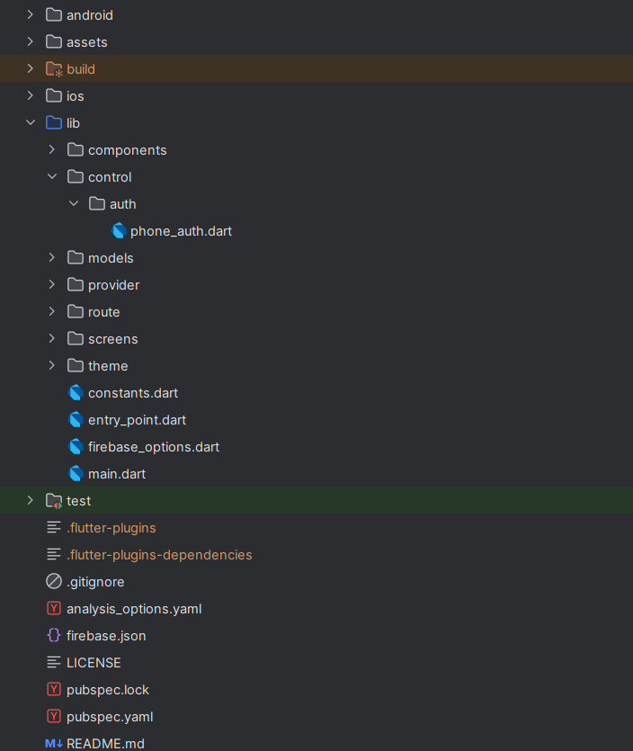

# Zyra - Fashion, Delivered in a Flash
---

### [```Download and try the App: Click Here```](https://github.com/shubhamranswal/zyra/releases/download/APK/app-release.apk)

### Project Structure - MVC
<p align="center">
  
</p>

### Key Features

- **Attractive Landing Page**: Engaging visuals and animations to capture user attention.
- **OTP-Based Authentication**: Simulated login using a fixed OTP for user convenience.
- **Product Listing**: Responsive grid and list views to browse items.
- **Cart Management**: Add, remove, and update quantities of items in the cart.
- **User Sessions**: Users remain logged in until they choose to log out.
- **Provider**: State manager used in this application.

## Screens in Zyra

Zyra features various screens to enhance user experience:

### Onboarding
- Introduction to app features.

### Authentication
- Login
- OTP Verification (Simulated)

### Home
- Home with carousels
- Product Listings in sections

### Discover
- Search Product in Grid
- Search Product in List

### Product
- Product Details
- Color, Size and Quantity
- Size Chart
- Additional Details

### Cart
- View & Manage Cart

### Profile
- User profile and actions

---
## Setup Instructions

### Prerequisites
- Flutter SDK installed on your machine.
- Android Studio or Xcode for running the app on Android and iOS devices.

### Steps to Run the App

1. **Clone the Repository**:
   ```bash
   git clone https://github.com/shubhamranswal/zyra.git
   cd zyra
   ```

2. **Install Dependencies**:
   ```bash
   flutter pub get
   ```

3. **Run the App**:
   ```bash
   flutter run
   ```

### Testing OTP Login
- Launch the app.
- On the login screen, enter any phone number and proceed.
- Enter `1234` as the OTP to simulate successful login.

### This project has been tested on Android devices only. May require some additional process to test in iOS devices.

## Screenshots

**Splash Screen:**
<p align="center">
  
</p>

**Landing Page:**
<p align="center">
  
</p>

**Login Screen:**
<p align="center">
  
</p>

**Discover Page & Product Details:**
<p align="center">
  
</p>

**Cart Page:**
<p align="center">
  
</p>

**Profile Page:**
<p align="center">
  
</p>

## Contributions

We love contributions! If you have ideas for new features or improvements, feel free to open an issue or submit a pull request. Let's make this app even better together!

## License

This project is licensed under the MIT License. See the [LICENSE](LICENSE) file for more details.

## Acknowledgments

- Huge thanks to the Flutter community for their amazing support and resources!
- Special shoutout to the various libraries and tools that made this project possible!
- Assets taken from multiple github repositories, google search index and etc.

## Contact Information

For any questions or support, feel free to reach out:

- Email: [shubhamranswal@gmail.com]
---